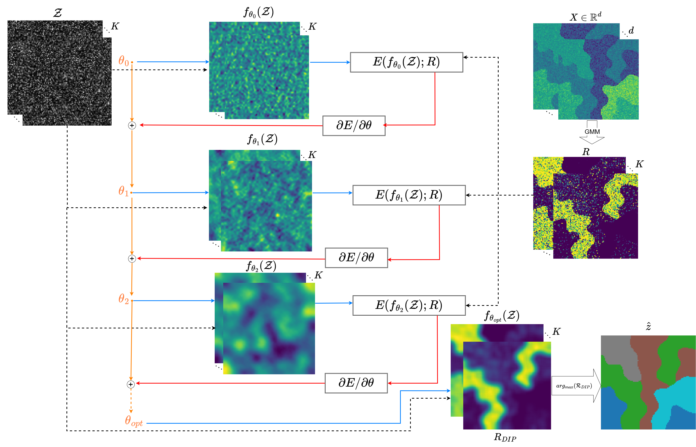

# Unsupervised Spatially Aware Gaussian Mixture Model via Implicit Deep Priors (DIP-SGMM)

This is the implementation of Spatial Aware GMM via Deep Priors, which has been accepted in GeoCV @WACV 2026. You can find our paper via 



## Dependencies

```
conda env create -f environment.yml
conda activate dip-sgmm
```

## Data

The anisotropic dataset is taken from the repository https://github.com/priestcyj/Yunjie-Chen and was originally used in the corresponding publication.


## Citation/BibTex
<!--
```

@inproceedings{dip-sgmm26,
  title={Unsupervised Spatially Aware Gaussian Mixture Model via Implicit Deep Priors},
  author={Herbert Rakotonirina, Théophile Lohier, Julien Baptiste},
  booktitle={Proceedings of the Winter Conference on Applications of Computer Vision},
  pages={591--598},
  year={2026}
}
```
-->
## Contact

- Herbert RAKOTONIRINA, h.rakotonirina@brgm.fr, [https://scholar.google.fr/citations?user=EZivnj8AAAAJ](https://scholar.google.fr/citations?user=EZivnj8AAAAJ)
